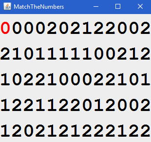
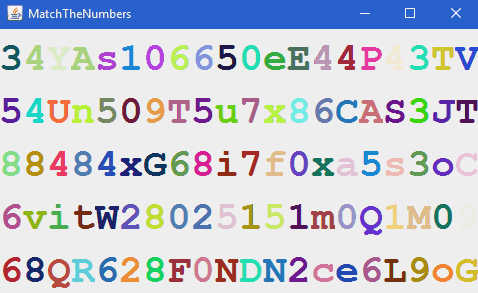

# Match the Numbers

Try to make all the numbers equal by traversing them.

Also works as a beautiful simulation in animation mode.

 

## Gameplay & Features

- There are two modes.
- In normal game mode

  - Change the digits by visiting them using the arrow keys in the keyboard.
  - Either the digit you move from or the digit you go to is changed (movement type).
  - If you visit a digit that is equal to the maximum digit, it is reset to 0.
  - Game ends if you make all digits equal (to the max digit).
  - Controlling the movements in the edges.

- In animation mode

  - Watch the changing characters.
  - Pause the animation by pressing _P_ and view a text containing the characters.
  - Pausing automatically when window loses focus.

There are some customization options for adding variety. You can set these options using _MatchTheNumbersConfiguration.ini_ file after building (Hard-coding options into code is not necessary). This file is read before every round so you can play each round with different options.

## Customizations

- Specify the size of the label.
- Select the total number of horizontal and vertical characters.
- Choose the game type.
- For the normal game mode

  - Set the minimum and maximum digit.
  - Select the movement type.

- For the animation mode

  - Specify how many frames appear in one second.
  - Select which type of character(s) appear.
  - Choose which type of letter(s) appear.
  - Choose the color type of labels (b&w or random colors).
